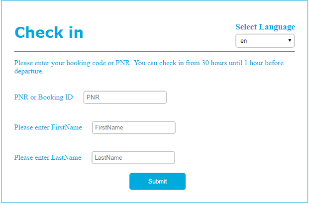
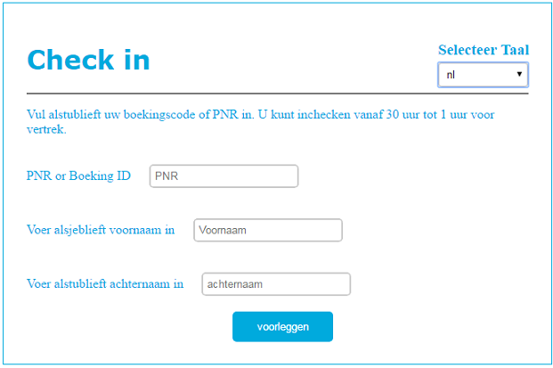
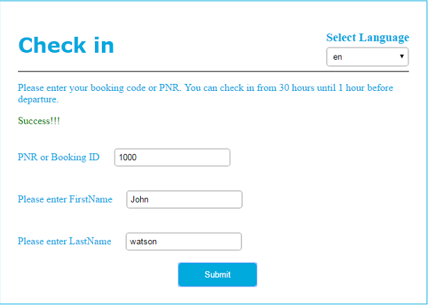
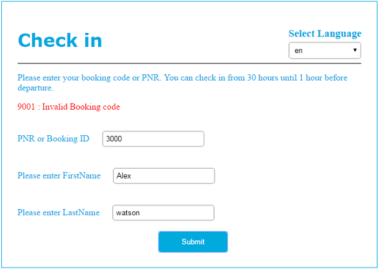

# AirlineCheckin

It's a Sample Airline CheckIn Application using @Angular-Cli as front-end and Node.js as middleware. It also supports multi language conversion feature. I've written few basic Unit Test Cases using Karma.js for POST service call.

## Screens

### Check in screen in English 

### Check in screen in Dutch 

### Check in screen with success scenario

### Check in screen with faliure scenario

